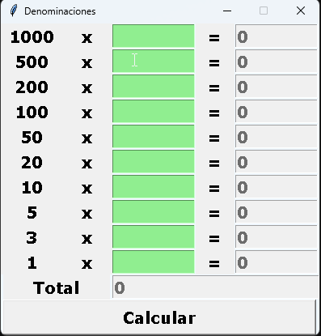
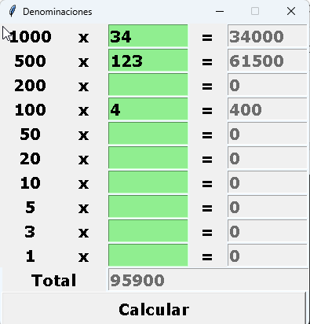

# Cash Counter

Una pequeña aplicación de escritorio en Tkinter para contar dinero por denominaciones. Creada en 2024 como mi primer proyecto real de programación, para agilizar el conteo de efectivo en un trabajo de tienda.

[](https://opensource.org/licenses/MIT)
[](https://www.python.org/downloads/)

> 🇪🇸 Español · 🇬🇧 [English version](README.md)

---

## 📖 Contexto

En la tienda donde trabajaba, contar la caja al final del día era lento. Había que multiplicar cada denominación por la cantidad de billetes que tenías y sumar todo manualmente, todos los días.

Esta aplicación reemplaza eso. Introduciendo cuántos billetes tienes de cada denominación (1000, 500, 200, 100, 50, 20, 10, 5, 3, 1), calcula el subtotal por denominación y el total general al instante.

---

## ⚠️ Nota sobre este proyecto

Este es mi **primer proyecto de programación**. Lo escribí antes de aprender Git, control de versiones, testing o buenas prácticas. Se conserva aquí como registro histórico de dónde empecé.

No tiene tests, ni documentación, y tiene algunas asperezas (sin validación de entrada, por ejemplo). Pero resolvía un problema real para mí, y fue la razón por la que seguí aprendiendo.

Dejé el código intencionadamente tal como estaba. Sin refactorizar, sin limpiar.

---

## 🛠️ Stack Tecnológico

- Python 3
- Tkinter (biblioteca estándar)

Sin dependencias externas.

---

## 🚀 Cómo ejecutarlo

No requiere instalación. Clona el repositorio y ejecuta el script:

```bash
git clone https://github.com/JavierVizGarriDev/cash-counter.git
cd cash-counter
python cash_counter.py
```

Se abre una ventana con la tabla de denominaciones. Introduce la cantidad de billetes que tienes de cada denominación, y la aplicación calculará los subtotales y el total general.

---

## 📸 Captura

| Ventana vacía | Rellena y calculada |
|---|---|
|  |  |

---

## 📄 Licencia

Este proyecto está bajo la Licencia MIT — consulta el archivo [LICENSE](LICENSE) para más detalles.

---

## 👤 Autor

**Javier A. Vizcaino Garriga**
- GitHub: [@JavierVizGarriDev](https://github.com/JavierVizGarriDev)
- Email: javieralejandrovizcainogarriga@gmail.com

---

<p align="center">
  <i>Mi primer proyecto. Tosco, pero funcionaba.</i>
</p>